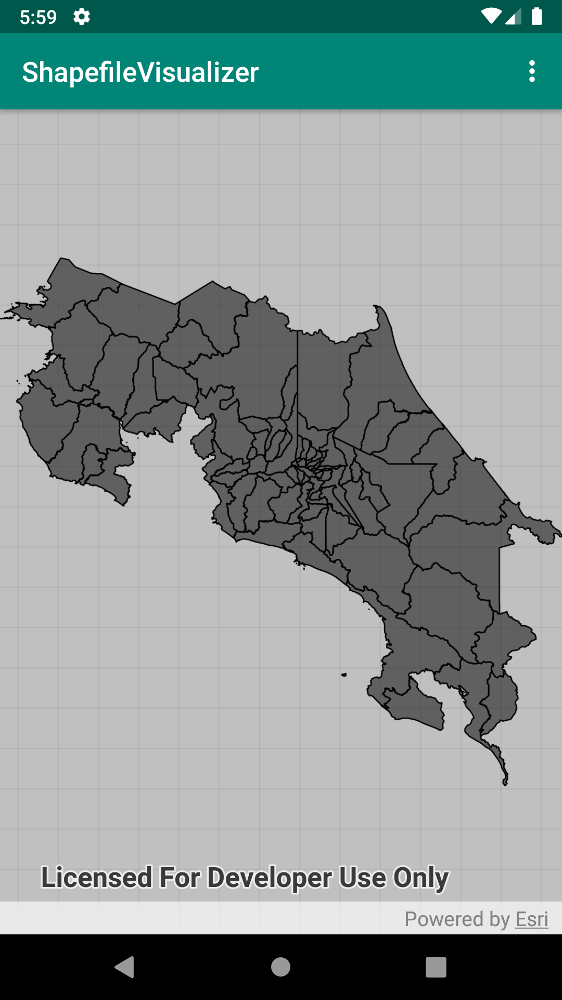

Shapefile visualizer
===========================================================================================
Android application for visualizing shapefiles.

Package Description
---
This package allows you to visualize shapefiles in your mobile phone using the ArcGIS Runtime SDK for Android [1]. For sample purposes, a shapefile with the cantons of Costa Rica is provided [2]. The shapefile can be personalized by changing the filename on the "string.xml" and in the MainApp.featureLayerShapefile method.

References
---
1. ArcGIS Runtime SDK for Android Samples https://developers.arcgis.com/android/ (https://github.com/Esri/arcgis-runtime-samples-android)
2. Portal de datos abiertos. Distritos de Costa Rica. URL: http://daticos-geotec.opendata.arcgis.com/datasets/741bdd9fa2ca4d8fbf1c7fe945f8c916_0

Demo
---
You can download a demo APK from https://play.google.com/store/apps/details?id=open.juanf.shapefilevisualizer.

License
---
Copyright (c) 2019, Juan M. Fonseca-Solís  
The source code is released under the [GPL](https://www.gnu.org/licenses/gpl-3.0.en.html) license.
